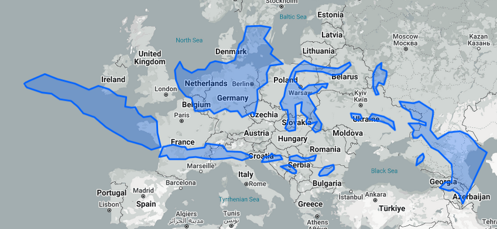

# Datawan Labs: Visualizing School Distribution and Population Density in Indonesia


## Background

Indonesia’s geography makes it tricky to ensure schools are accessible across all regions. By mapping where people live alongside school locations, this study shows how spatial data can reveal patterns of educational access across the country. This approach helps create a clearer picture of how schools are distributed, making it easier to understand and address educational reach for communities throughout Indonesia.

<details>
  <summary>
    Because of Mercator projections, it’s easy to get a bias view of how big certain countries are. If you’re curious about the actual size of Indonesia, here’s how it compares to Europe:
  </summary>

  

</details>

## Technical Details

This project is my experiment with interactive big data visualizations for some upcoming projects. My goal is to see how less reources I can use to manage, process, and parse big data visualizations but the interactivity high. Here’s a breakdown of the choices I made and the reasons behind them.

### Decisions On Stack

In this section, I’ll explain my stacks choices for this project, the focus is on finding the right balance between performance, usability, and future readiness.

#### Data

You can check out the [data](#data) section for more details, but here’s how I manage that data. I’m working with two datasets, 475.272 rows with 21 columns covering schools across Indonesia and 573.841 rows with 6 columns center of 1km² population grid. Not big, but still big enough when transferring it over a network. So, I needed a way to store this data, query parts of it, and minimize the data transfer and storage costs.

Instead of setting up a traditional server-side database like PostgreSQL or MongoDB, I decided against using a DBMS here. Running a full DBMS just to store static data seemed overkill since this data doesn’t change. Managing a server to handle heavy data loads, while keeping response times low, can be complex and costly, especially when I’m not even updating the data regularly.

So, I thought: why not just use static files? It's like good idea right, but formats like JSON and CSV didn’t fit in because:

1. They’re too big to transfer efficiently.
2. I can dynamic query to the data.
3. `JSON.parse` on a massive file is a performance nightmare
4. They require loading the whole file at "once".\*

So I need another static format that more effective and smaller, and I choose **parquet**. Parquet lets me compress the data effectively so the size will be smaller. Also we can query the data partially with SQL with duckdb-wasm (we will talk about it later) and we don't have to parse, because the data is in binary format and can be used easily with `duckdb` and `apache arrow`. duckdb-wasm enables more advanced features like partially consuming the data. as a result, we may not need to download the entire file for a query but only required bytes, then same request will not request again. Here comparison files size, in json, csv, and parquet for data used in this project:


With Parquet, I can get file sizes 8-20 times smaller than JSON or CSV. Storing it as a static asset is also easier—just put it in S3 or similar storage.

> If you use cloudflare, Because DuckDB query rely on [range header request](https://developer.mozilla.org/en-US/docs/Web/HTTP/Headers/Range), storing static files in cloudflare pages does not work because cloudflare pages / worker assets does not work with range request, but you can store it in R2, and add accept range headers.

#### Solid Start

I want this app to run with as few resources as possible, meaning no heavy servers if I can avoid it. I went with Solid Start as the framework because Solid Start offer more isomorphic way to create web apps, from what rendering method, server actions / functions, api handler, deployment preset and more. I started using only Client Side Rendering, and if I need to add new features that require server instead just SPA, I can do that easily, without much changes.

> When this project is started, [SolidHack](https://hack.solidjs.com/) event was starting up too, so I thought—why not join in?

#### Duck DB

Since the main goal is interactivity, I want users to be able to customize anything, including the data. With a big dataset like this, I needed a way to query it straight from the client side. DuckDB was the perfect fit because it lets me query remote files in chunks, handles data parsing, and manages network requests smoothly.

Duckdb offers extensions like SPATIAL extension that we can use to add more features to our apps, such as query data in specific location, radius-based searches, etc.

If you wonder why not just run DuckDB on a server and send the binary results to the client?. this approach is also possible and one of my options, but every query send to server, the data must be transfered back to client even if it is same query or logically same. If we use duckdb wasm in client, every request to duckdb does not alwasy trigger network request if the data or partial data is already available in memory. So the more query you made, the faster query result is.

#### Maplibre GL & Deck.gl

Maplibre GL is fork of MapBox when mapbox use propertiary license. This fork offer features almost same in mapbox. We use maplibre and deck.gl to visualize hundreds thousand of Point Of Interest without lag and more performants.

#### Web Worker for Post Processing

After the data’s queried, we need to process the result, like calculating for legend values, generating colors, and so on. I use web workers for this, which keeps the main thread free and prevents blocking. Also utilizing binary data to minimize in data transfer between worker thread to main thread or vice versa. duckdb return query result in apache arrow, then this data transfered to worker as buffer. Transfering buffer is prefered because we can use [Transferable Object](https://developer.mozilla.org/en-US/docs/Web/API/Web_Workers_API/Transferable_objects) to speed up the data handoff between main thread to worker thread or vice versa. Offloading process to web worker also prevent blocking in main thread.


> geometry column in duckdb need to return as WKB in the query, then we can transform it to FLoat64Array. because, geometry column used in duckdb is not common format, so we need another binary format for geometry, CMIIW. ([source](https://duckdb.org/2023/04/28/spatial.html#example-usage))

To get better perfomance when visualizing data in maplibre, we utilizing binary format or [TypedArray](https://developer.mozilla.org/en-US/docs/Web/JavaScript/Reference/Global_Objects/TypedArray) to store coordinates and colors data, like Uint8Array, Float64Array, etc, as stated [here](https://deck.gl/docs/developer-guide/performance#use-binary-data), it has more performance benefits. This operations happens in this web worker, check [schools-worker](./src/services/worker-point.ts) and [grid-worker](./src/services/worker-grid.ts).

Using web worker in solid is easy, just store worker object in [solid store](./src/stores.ts) then you can listen worker message from multiple components.

### What The Catch

This approach has some caveats, most of them in duckdb:

- DuckDB WASM file is big, compared to sqlite-wasm or pglite
- DuckDB WASM still does not manage [request waterfall](https://github.com/duckdb/duckdb-wasm/issues/1087), and still cannot persist the data to local browser storage, like indexedDB or [OPFS](https://github.com/duckdb/duckdb-wasm/pull/1490).
- This project works best if you just want to create visualizations with static data, for dynamic data where you need to update the data may be another approach is preferable.

### What's next

I have plan to try something like this, may be using another database engine like sqlite-wasm or [pglite](https://pglite.dev/), and experiment with dynamic data handling in both client and server contexts.

## How To Use This Apps

This website is built as playground, wtwo query handlers: one for querying school locations (Points of Interest) and the other for the population grid. and each has only one data source `sekolah.parquet` and `popgrid.parquet`. All query results will be processed before being displayed on the maps. You can query whatever you want, like filtering only specific conditions or display all of data, As long as you follow the rules, your query and the data will be display correctly on maps.

> Sekolah is Indonesian words means 'schools' in english

We use [duckdb](https://duckdb.org/) as query engine to query our data directly from your browser, You can use a SQL-like dialect to create your queries, and we also utilize the [SPATIAL EXTENSION](https://duckdb.org/2023/04/28/spatial.html). If you're unsure how to use it, you can open the DuckDB console to experiment with any queries or to run queries that you do not want to display on the maps.

### Schools Location

You can return any columns from your query, but to display the data on the maps, your query results must include the following columns:

| columns                          | required | default | comments                                                                                                                                                                                                                                                        |
| -------------------------------- | -------- | ------- | --------------------------------------------------------------------------------------------------------------------------------------------------------------------------------------------------------------------------------------------------------------- |
| `ST_AsWKB(location) as location` | yes      | `-`     | Your query must return the location column using ST_AsWKB(location). [`ST_AsWKB`](https://duckdb.org/docs/extensions/spatial/functions.html#st_aswkb) is a special function from DuckDB that transforms geometry into Well-Known Binary data for later parsing. |
| `color`                          | no       | `-`     | We will generate a legend based on this column. After the query is completed, we will compare it to generate colors based on the values and the total colors used. You can use any column, but return the column name as `color`                                |
| `radius`                         | no       | `50`    | Similar to the color, you can customize the radius (in meters) of each point by returning a `radius` column.                                                                                                                                                    |

Additional columns from you query, such as `nama`, `pd` or others, etc (refers to [this](#metadata)) and this column will be shown in tooltip only when you hover the data.

### Population Density

You can run any query similar to the one for school locations, but the query for population density will be displayed as a grid instead of points. The values for the legend will be transformed based on the total colors, so each cell corresponds to the maximum values. Here are the columns you can use to display the data:

| columns                        | required | default | comments                                                                                                                                                                                                                                                          |
| ------------------------------ | -------- | ------- | ----------------------------------------------------------------------------------------------------------------------------------------------------------------------------------------------------------------------------------------------------------------- |
| ST_AsWKB(location) as location | yes      | `-`     | Your query must return the location column using `ST_AsWKB(location)`. [`ST_AsWKB`](https://duckdb.org/docs/extensions/spatial/functions.html#st_aswkb) is a special function from DuckDB that transforms geometry into Well-Known Binary data for later parsing. |
| value                          | yes      | `-`     | The `value` column represents the population density data for each location. We will calculate the results and total colors to generate the color for each cell based on the value.                                                                               |

### Sample Query

Here is sample query if you want to use

- All Senior High Schools In Jakarta
  ```sql
  SELECT
    75 as radius,
    jenjang as color,
    ST_AsWKB(location) as location
  FROM
    sekolah.parquet
  WHERE
    kode_provinsi = '31' AND
    jenjang IN ['SMA', 'SMK', 'MA'] AND
    location_status = 'valid'
  ```
- Public Schools in Central Java
  ```sql
  SELECT
    500 as radius,
    jenjang as color,
    ST_AsWKB(location) as location
  FROM
    sekolah.parquet
  WHERE
    kode_provinsi = '33' AND
    status = 'negeri' AND
    location_status = 'valid'
  ```
- Population Grid In Bali
  ```sql
  SELECT
    value,
    ST_AsWKB(location) as location
  FROM
    popgrid.parquet
  WHERE
    provinsi = 'Bali'
  ```

## Data

For this purpose, we use two data sources: Registered Indonesia Schools and a Population Density Map. These datasets are collected and processed before being presented on a web-based platform. For easy of use, we use parquet for final data

### Registered Indonesia Schools

Indonesia has two primary ministries that handle education: the Ministry of Education and Culture (Kementerian Pendidikan dan Kebudayaan, or Kemdikbud) and the Ministry of Religious Affairs (Kementerian Agama, or Kemenag). Both ministries oversee schools across similar levels, from pre-elementary (TK) to elementary, junior, and senior high schools, with most schools following the curriculum set by Kemdikbud. The main difference lies in school management, as schools under Kemenag focus primarily on religious education. This includes Madrasahs (Arabic for "schools"), which provide additional religious subjects, as well as Boarding Schools (Pondok Pesantren), which may follow unique curricula tailored to their religious focus.

We collected data from both ministries websites and processed it to ensure consistency in the final dataset. This involved standardizing metadata, including the total number of students, teachers, and employees, along with the crucial coordinate locations of each school. Additionally, we verified that each school's Point of Interest (POI) matched the intended region by comparing coordinates with regional boundaries. Using this method, we were able to confirm that 380,144 out of 475,252 entries were valid.

#### Metadata

Table Name : [`sekolah.parquet`](./public/sekolah.parquet)

| Column Name       | Data Type | Comments                                                                          |
| ----------------- | --------- | --------------------------------------------------------------------------------- |
| nama              | VARCHAR   | Name of the school                                                                |
| npsn              | VARCHAR   | National school registration number                                               |
| ptk               | BIGINT    | Total number of teachers                                                          |
| ptk_laki          | BIGINT    | Number of male teachers                                                           |
| ptk_perempuan     | BIGINT    | Number of female teachers                                                         |
| pegawai           | BIGINT    | Total number of staff/employees                                                   |
| pegawai_laki      | BIGINT    | Number of male staff/employees                                                    |
| pegawai_perempuan | BIGINT    | Number of female staff/employees                                                  |
| pd                | BIGINT    | Total number of students                                                          |
| pd_laki           | BIGINT    | Number of male students                                                           |
| pd_perempuan      | BIGINT    | Number of female students                                                         |
| rombel            | BIGINT    | Number of classes                                                                 |
| kode_provinsi     | VARCHAR   | Province code (Kemendagri)                                                        |
| kode_kabupaten    | VARCHAR   | District/city code (Kemendagri)                                                   |
| provinsi          | VARCHAR   | Province name (Kemendagri)                                                        |
| kabupaten         | VARCHAR   | District/city name (Kemendagri)                                                   |
| alamat            | VARCHAR   | School address                                                                    |
| status            | VARCHAR   | Status of the school, the value is either `negeri` (public) or `swasta` (Private) |
| jenjang           | VARCHAR   | Educational level of the school, (e.g SMA, MA, SMP, etc)                          |
| akreditasi        | VARCHAR   | Accreditation level of the school                                                 |
| source            | VARCHAR   | Source of the data collected, `kemenag` or `kemdikbud`                            |
| location          | GEOMETRY  | Geographic coordinates (lat, long) in geometry format                             |
| location_status   | VARCHAR   | Verification status of the school's location                                      |

Here information of possible values for `location_status` after comparing with region geometry, we use 514 district / city boundaries to check, if coordinates is inside the reported region or outside.

| `location_status`   | information                                                                                           |
| ------------------- | ----------------------------------------------------------------------------------------------------- |
| valid               | Reported region and coordinates are valid for either `kabupaten` (district) or `provinsi` (province). |
| potential-mistmatch | `kabupaten` (district) is incorrect, but the location is within the same `provinsi` (province).       |
| invalid             | Neither `kabupaten` nor `provinsi` matches the coordinates, coordinates outside of region             |
| maybe               | for Indonesia Schools Abroad (Luar Negeri), insufficient data for validation.                         |
| not-mapped          | Incorrect coordinate data, such as (0,0).                                                             |

### Population Density Map

We understand that no actual data for population density maps, all available data is only estimation based on it's location and statistics data. For population density maps, we used GHS-POP data from [Global Human Settlement Layer](https://human-settlement.emergency.copernicus.eu/).

We convert the data from raster to xyz values then combine them with regencies geometry to add more additional geographic information for each point.

#### Metadata

Table Name : [`popgrid.parquet`](./public/popgrid.parquet)

| Column Name    | Data Type | Comments                                 |
| -------------- | --------- | ---------------------------------------- |
| value          | DOUBLE    | Population density estimation            |
| location       | GEOMETRY  | Center of 1km\*1km grid (30 arc seconds) |
| kode_provinsi  | VARCHAR   | Province code (Kemendagri)               |
| kode_kabupaten | VARCHAR   | District/city code (Kemendagri)          |
| provinsi       | VARCHAR   | Province name (Kemendagri)               |
| kabupaten      | VARCHAR   | District/city name (Kemendagri)          |
